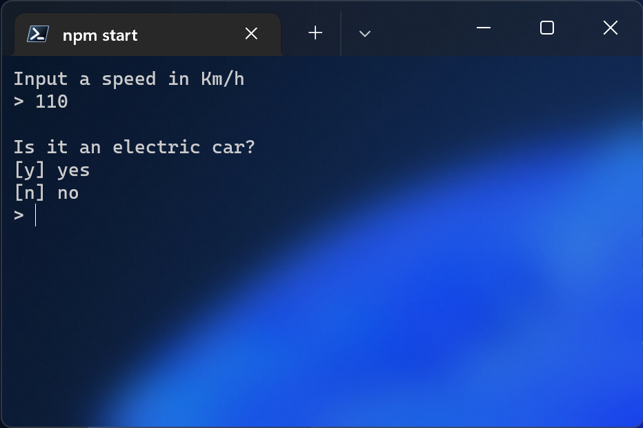

# Fake Speed Detector

A speed detector...but fake 😁 Try it, i bet you'll laugh!




More in the future... 💪

# Technologies

- [Secret AI](https://github.com/pncsoares)
- [Node](https://nodejs.org/en/docs/)
- [JavaScript](https://developer.mozilla.org/en-US/docs/Web/JavaScript)
- [ ] HTML
- [ ] CSS

# Setup

## Clone repository

Create and go to the directory where you want to place the repository

```bash
  cd my-directory
```

Clone the project

```bash
  git clone https://github.com/pncsoares/fake-speed-detector.git
```

Go to the project directory

```bash
  cd fake-speed-detector
```

## How to execute

Open terminal and execute the following command:

```bash
  npm start
```

# License

MIT